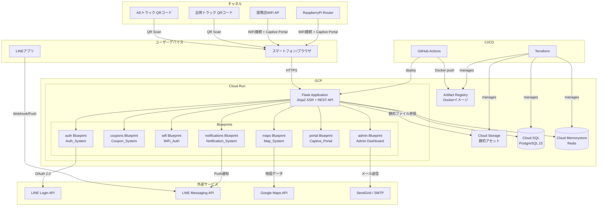
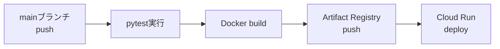
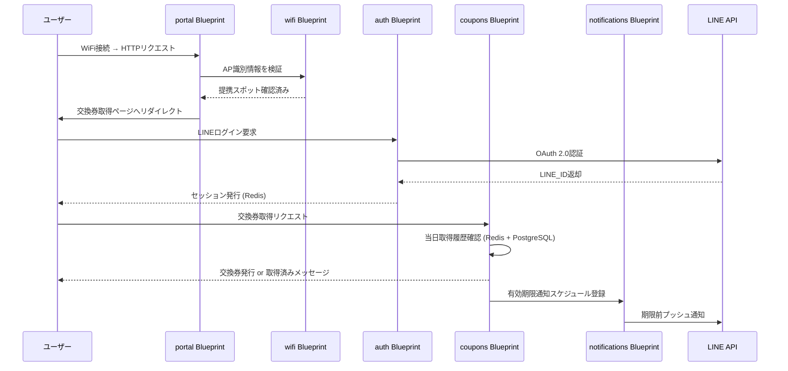
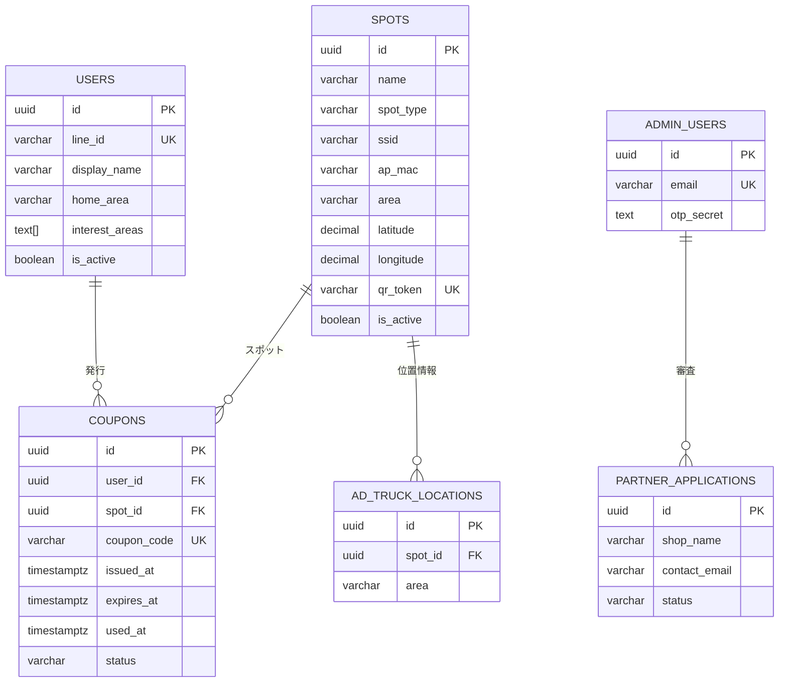

# Design Document: 3939SPOT

## Overview

3939SPOTは、無料WiFiスポットを活用してブラックサンダー（チョコレート菓子）の交換券を配布し、販促活動を促進するWebサービスです。URL: https://3939.spot/

### サービスコンセプト

```
ユーザー体験フロー:
  [ADトラック/出荷トラック発見] → QRコード読み取り → LINE認証 → 交換券取得
  [提携店来店] → WiFi接続 → キャプティブポータル → LINE認証 → 交換券取得
  [LINEbot] → 通知受信 → 提携店マップ → 来店 → 交換券取得
```

### 主要チャネル

1. **ADトラックチャネル**: 日本各地を巡回する広告トラックにQRコードを掲示。ユーザーがスキャンして交換券取得。
2. **出荷トラックチャネル**: 走行中の出荷トラックにQRコードを掲示。通りすがりのユーザーが参加。
3. **提携店WiFiチェックインチャネル**: 提携店のWiFi接続をトリガーにキャプティブポータル経由で交換券取得。
4. **RaspberryPiルーターチャネル**: 専用WiFiルーターを設置、接続ユーザーを専用コンテンツページへ自動誘導。

### 技術スタック

| レイヤー | 選定技術 | 理由 |
|---|---|---|
| バックエンド言語 | Python 3.12 | 豊富なライブラリ・GCP親和性 |
| Webフレームワーク | Flask 3.x | 軽量・Blueprintによるモジュール分割・SSR対応 |
| テンプレートエンジン | Jinja2 (Flask組み込み) | SSRベースのページ生成 |
| 仮想環境 | venv | Python標準の仮想環境管理 |
| 環境変数管理 | python-dotenv (.env) | ローカル開発・本番分離 |
| ORM | SQLAlchemy 2.x + Flask-SQLAlchemy | PostgreSQLアクセス |
| マイグレーション | Flask-Migrate (Alembic) | スキーマバージョン管理 |
| 主DB | Cloud SQL for PostgreSQL 15 | トランザクション整合性 |
| キャッシュ/セッション | Redis (Cloud Memorystore または Upstash Redis) | セッション・レート制限・キャッシュ |
| 認証 | LINE Login API (OAuth 2.0) | ユーザーが既存LINEアカウントを使用 |
| 通知 | LINE Messaging API | LINEプッシュ通知 |
| 地図 | Google Maps JavaScript API | 提携店マップ表示 |
| コンテナ | Docker + Artifact Registry | Cloud Runデプロイ用 |
| デプロイ先 | GCP Cloud Run | スケーラブルなサーバーレスコンテナ実行 |
| 静的ファイル | Google Cloud Storage | CSS/JS/画像配信 |
| CI/CD | GitHub Actions | テスト・ビルド・デプロイ自動化 |
| IaC | Terraform | GCPリソース管理 |
| RasPi OS | Raspberry Pi OS Lite | hostapd/dnsmasq/nodogsplash動作環境 |

---

## Architecture

### システム全体構成図



### CI/CD パイプライン



**GitHub Actions ワークフロー概要** (`.github/workflows/deploy.yml`):

```yaml
# トリガー: main ブランチへの push
# ステップ:
# 1. Python 3.12 セットアップ
# 2. pip install -r requirements.txt
# 3. pytest 実行（失敗でデプロイ中断）
# 4. Docker build
# 5. Artifact Registry へ push
# 6. Cloud Run へデプロイ
```

### プロジェクト構成

```
3939spot/
├── app/
│   ├── __init__.py          # Flask アプリファクトリ (create_app)
│   ├── auth/                # Auth_System Blueprint
│   │   ├── __init__.py
│   │   └── routes.py
│   ├── coupons/             # Coupon_System Blueprint
│   │   ├── __init__.py
│   │   └── routes.py
│   ├── wifi/                # WiFi_Auth Blueprint
│   │   ├── __init__.py
│   │   └── routes.py
│   ├── maps/                # Map_System Blueprint
│   │   ├── __init__.py
│   │   └── routes.py
│   ├── notifications/       # Notification_System Blueprint
│   │   ├── __init__.py
│   │   └── routes.py
│   ├── admin/               # Admin Dashboard Blueprint
│   │   ├── __init__.py
│   │   └── routes.py
│   ├── portal/              # Captive_Portal Blueprint
│   │   ├── __init__.py
│   │   └── routes.py
│   ├── models/              # SQLAlchemy モデル
│   │   ├── __init__.py
│   │   ├── user.py
│   │   ├── spot.py
│   │   ├── coupon.py
│   │   └── ...
│   ├── templates/           # Jinja2 テンプレート
│   └── static/              # 静的ファイル (GCS へアップロード)
├── tests/                   # pytest テスト
│   ├── conftest.py
│   ├── test_coupons.py
│   ├── test_wifi_auth.py
│   ├── test_notifications.py
│   ├── test_auth.py
│   └── property/            # property-based tests
│       └── test_properties.py
├── terraform/               # Terraform コード
│   ├── main.tf
│   ├── variables.tf
│   ├── outputs.tf
│   └── modules/
│       ├── cloud_run/
│       ├── cloud_sql/
│       ├── redis/
│       ├── storage/
│       └── iam/
├── .github/
│   └── workflows/
│       └── deploy.yml
├── Dockerfile
├── requirements.txt
├── .env.example
├── .env                     # gitignore 対象
└── run.py
```

### サブシステム間通信シーケンス



---

## Components and Interfaces

### 1. Auth_System (`app/auth/`)

LINE Login APIを使用したOAuth 2.0認証フローとセッション管理を担当します。Flask-Sessionを使用してセッションをRedisに保存します。

#### エンドポイント

```
GET  /auth/line/login       → LINE OAuthページへリダイレクト
GET  /auth/line/callback    → OAuth callbackハンドラー（コード交換・セッション発行）
POST /auth/logout           → セッション破棄
GET  /auth/me               → 現在のユーザー情報返却 (JSON)
POST /webhook/line          → LINE Messaging API Webhook (follow/unfollow/message)
```

#### セッション管理

- セッションは Redis に保存（Flask-Session、TTL: 30日、最終アクセスでリセット）
- セッションID は Secure/HttpOnly Cookie で管理
- LINE_ID をユーザー識別子として使用
- `@login_required` デコレーターで未認証アクセスを保護

### 2. Coupon_System (`app/coupons/`)

交換券の発行・管理・検証を担当します。

#### エンドポイント

```
POST /api/coupons/issue              → 交換券発行（spot_id 必須）
GET  /api/coupons/my                 → 保有交換券一覧取得
GET  /api/coupons/<coupon_id>        → 交換券詳細取得
POST /api/coupons/<coupon_id>/verify → 交換券検証（提携店スタッフ向け）
POST /api/coupons/<coupon_id>/redeem → 交換券使用（スタッフ操作）
```

#### 発行ロジック

```python
def issue_coupon(user_id: str, spot_id: str) -> Coupon | None:
    date_jst = get_jst_date()
    redis_key = f"coupon:daily:{user_id}:{spot_id}:{date_jst}"
    if redis.exists(redis_key):
        return None  # ALREADY_ISSUED
    coupon = Coupon(
        user_id=user_id,
        spot_id=spot_id,
        coupon_code=secrets.token_urlsafe(48),
        expires_at=datetime.now(JST) + timedelta(days=30)
    )
    db.session.add(coupon)
    db.session.commit()
    redis.setex(redis_key, ttl_until_midnight_jst(), 1)
    return coupon
```

### 3. WiFi_Auth (`app/wifi/`)

WiFi接続の正当性を検証します。

#### 検証パターン

- **パターンA（SSID/AP-MAC検証）**: リクエスト元のアクセスポイント識別情報を提携スポットリストと照合
- **パターンB（RasPi検証）**: カスタムHTTPヘッダー `X-RasPi-AP: 1` またはサブネット `192.168.4.0/24` での判定

#### エンドポイント

```
POST /api/wifi/verify        → WiFi接続検証 (JSON: {ssid, ap_mac} or headers)
GET  /api/wifi/spots         → 提携スポット一覧（管理者向け）
```

### 4. Captive_Portal Handler (`app/portal/`)

キャプティブポータル経由でのリダイレクト処理を担当します。

```
GET  /portal                → キャプティブポータルランディング (Jinja2 template)
GET  /portal/redirect       → 認証後コンテンツページへリダイレクト
```

### 5. Map_System (`app/maps/`)

提携店の地図表示・検索を担当します。

#### エンドポイント

```
GET    /api/spots                → 提携スポット一覧（lat/lng/keyword絞り込み対応）
GET    /api/spots/<spot_id>      → 提携スポット詳細
POST   /api/spots                → 提携スポット登録（管理者）
PUT    /api/spots/<spot_id>      → 提携スポット更新（管理者）
DELETE /api/spots/<spot_id>      → 提携スポット削除（管理者）
```

#### リアルタイム反映

- 登録・削除操作から5分以内に地図キャッシュを更新
- Redis キャッシュ（TTL: 5分）でパフォーマンスを確保

### 6. Notification_System (`app/notifications/`)

LINE Messaging API を使ったプッシュ通知を担当します。

#### エンドポイント

```
POST /api/admin/notifications/truck     → ADトラック位置更新 + 通知配信
POST /api/admin/notifications/blast     → 一斉メッセージ配信（管理者）
POST /api/admin/notifications/new-spot  → 新規提携店通知
```

#### 通知スロットリング

- ADトラック通知: 1ユーザー/1日 最大3回（Redis カウンター使用）
- 有効期限通知: 有効期限3日前にバッチ（Cloud Schedulerまたはcron）で送信

### 7. Admin Dashboard (`app/admin/`)

管理者専用の一元管理インターフェースを提供します。MFA（メール+パスワード+TOTP）で保護します。

#### エンドポイント

```
GET  /admin                           → ダッシュボード（統計）
POST /admin/auth/login                → 管理者ログイン
POST /admin/auth/mfa/verify           → OTP検証
GET  /admin/trucks                    → ADトラック一覧
PUT  /admin/trucks/<truck_id>/location → ADトラック位置更新
POST /admin/qr/generate               → QRコード生成
GET  /admin/partners/applications     → 提携申し込み一覧
PUT  /admin/partners/<app_id>/approve → 提携店承認
DELETE /admin/partners/<spot_id>      → 提携店削除
```

### 8. LP・フロントエンドページ（Jinja2 SSR）

| ページ | パス | 説明 |
|---|---|---|
| LP | `/` | サービス総合案内 (Jinja2 template) |
| 交換券取得 | `/coupon/get?spot=<spot_id>` | QR/WiFi経由で交換券取得 |
| 交換券一覧 | `/coupon/list` | 保有・履歴一覧 |
| 提携店マップ | `/map` | Google Maps統合検索 |
| 提携店募集 | `/partner` | 提携申し込みページ |
| WiFi限定コンテンツ | `/exclusive` | WiFi接続限定コンテンツ |
| 管理者 | `/admin` | 管理者ダッシュボード |

### 9. Terraform管理リソース

```hcl
# terraform/ で管理するGCPリソース
resource "google_cloud_run_service"           # Flask アプリコンテナ
resource "google_storage_bucket"             # 静的アセット (CSS/JS/画像)
resource "google_artifact_registry_repository" # Dockerイメージ
resource "google_sql_database_instance"      # Cloud SQL PostgreSQL 15
resource "google_redis_instance"             # Cloud Memorystore (Redis)
resource "google_service_account"            # Cloud Run 実行SA
resource "google_project_iam_binding"        # IAMバインディング
resource "google_vpc_network"                # VPC ネットワーク
resource "google_vpc_access_connector"       # Serverless VPC Access
```

---

## Data Models

### users テーブル（SQLAlchemy: `app/models/user.py`）

```python
class User(db.Model):
    __tablename__ = "users"
    id             = db.Column(UUID, primary_key=True, default=uuid4)
    line_id        = db.Column(db.String(100), unique=True, nullable=False)
    display_name   = db.Column(db.String(255))
    picture_url    = db.Column(db.Text)
    home_area      = db.Column(db.String(100))        # 居住地（街単位）
    interest_areas = db.Column(ARRAY(db.String))      # 関心地域リスト
    is_active      = db.Column(db.Boolean, default=True)  # LINEbot ブロック状態
    created_at     = db.Column(db.DateTime(timezone=True), server_default=func.now())
    updated_at     = db.Column(db.DateTime(timezone=True), onupdate=func.now())
```

### spots テーブル（SQLAlchemy: `app/models/spot.py`）

```python
class Spot(db.Model):
    __tablename__ = "spots"
    id             = db.Column(UUID, primary_key=True, default=uuid4)
    name           = db.Column(db.String(255), nullable=False)
    spot_type      = db.Column(db.String(20), nullable=False)
    # spot_type: 'ad_truck' | 'ship_truck' | 'store' | 'raspi'
    ssid           = db.Column(db.String(100))
    ap_mac         = db.Column(db.String(17))
    address        = db.Column(db.Text)
    area           = db.Column(db.String(100))
    latitude       = db.Column(db.Numeric(9, 6))
    longitude      = db.Column(db.Numeric(9, 6))
    business_hours = db.Column(db.Text)
    wifi_info      = db.Column(db.Text)
    is_active      = db.Column(db.Boolean, default=True)
    qr_token       = db.Column(db.String(100), unique=True)
    created_at     = db.Column(db.DateTime(timezone=True), server_default=func.now())
    updated_at     = db.Column(db.DateTime(timezone=True), onupdate=func.now())
```

### coupons テーブル（SQLAlchemy: `app/models/coupon.py`）

```python
class Coupon(db.Model):
    __tablename__ = "coupons"
    __table_args__ = (
        UniqueConstraint(
            "user_id", "spot_id",
            func.date_trunc("day", cast(func.timezone("Asia/Tokyo", "issued_at"), Date)),
            name="unique_daily_spot"
        ),
    )
    id              = db.Column(UUID, primary_key=True, default=uuid4)
    user_id         = db.Column(UUID, db.ForeignKey("users.id"), nullable=False)
    spot_id         = db.Column(UUID, db.ForeignKey("spots.id"), nullable=False)
    coupon_code     = db.Column(db.String(64), unique=True, nullable=False)
    issued_at       = db.Column(db.DateTime(timezone=True), server_default=func.now())
    expires_at      = db.Column(db.DateTime(timezone=True), nullable=False)
    used_at         = db.Column(db.DateTime(timezone=True))
    used_spot_id    = db.Column(UUID, db.ForeignKey("spots.id"))
    status          = db.Column(db.String(20), default="active")
    # status: 'active' | 'used' | 'expired'
    expiry_notified = db.Column(db.Boolean, default=False)
```

### sessions テーブル（PostgreSQL補完 + Redis主体）

```python
class Session(db.Model):
    __tablename__ = "sessions"
    id         = db.Column(db.String(128), primary_key=True)
    user_id    = db.Column(UUID, db.ForeignKey("users.id"), nullable=False)
    created_at = db.Column(db.DateTime(timezone=True), server_default=func.now())
    expires_at = db.Column(db.DateTime(timezone=True), nullable=False)
    last_seen  = db.Column(db.DateTime(timezone=True), server_default=func.now())
```

### partner_applications テーブル

```python
class PartnerApplication(db.Model):
    __tablename__ = "partner_applications"
    id            = db.Column(UUID, primary_key=True, default=uuid4)
    shop_name     = db.Column(db.String(255), nullable=False)
    address       = db.Column(db.Text, nullable=False)
    contact_name  = db.Column(db.String(255), nullable=False)
    contact_email = db.Column(db.String(255), nullable=False)
    wifi_info     = db.Column(db.Text, nullable=False)
    status        = db.Column(db.String(20), default="pending")
    # status: 'pending' | 'approved' | 'rejected'
    submitted_at  = db.Column(db.DateTime(timezone=True), server_default=func.now())
    reviewed_at   = db.Column(db.DateTime(timezone=True))
    reviewer_id   = db.Column(UUID, db.ForeignKey("admin_users.id"))
```

### admin_users テーブル

```python
class AdminUser(db.Model):
    __tablename__ = "admin_users"
    id            = db.Column(UUID, primary_key=True, default=uuid4)
    email         = db.Column(db.String(255), unique=True, nullable=False)
    password_hash = db.Column(db.Text, nullable=False)
    otp_secret    = db.Column(db.Text, nullable=False)   # TOTP秘密鍵
    created_at    = db.Column(db.DateTime(timezone=True), server_default=func.now())
```

### ad_truck_locations テーブル

```python
class AdTruckLocation(db.Model):
    __tablename__ = "ad_truck_locations"
    id         = db.Column(UUID, primary_key=True, default=uuid4)
    spot_id    = db.Column(UUID, db.ForeignKey("spots.id"), nullable=False)
    area       = db.Column(db.String(100), nullable=False)
    updated_at = db.Column(db.DateTime(timezone=True), server_default=func.now())
    updated_by = db.Column(UUID, db.ForeignKey("admin_users.id"))
```

### Redisキー設計

```
session:{session_id}                         → ユーザーセッション（TTL: 30日）
coupon:daily:{user_id}:{spot_id}:{date_jst}  → 1日1枚制限フラグ（TTL: 翌日00:00まで）
rate_limit:ip:{ip_address}                   → IPレート制限カウンター（TTL: 5分）
notif:truck:{user_id}:{date_jst}             → ADトラック通知カウンター（TTL: 翌日00:00まで）
spots:cache                                  → 提携スポット一覧キャッシュ（TTL: 5分）
```

### データモデル ER図



---

## RaspberryPi Router 設計

### ハードウェア構成

```
Raspberry Pi Zero W
  wlan0 (内蔵WiFi) ──→ 上流WiFi (インターネット接続, client モード)
  wlan1 (USB WiFiアダプタ) ──→ ユーザー向けSSID (AP モード)
```

### ソフトウェアスタック

```
OS: Raspberry Pi OS Lite（最新安定版）
├── hostapd      (wlan1 アクセスポイント, WPA2-PSK/AES)
├── dnsmasq      (DHCP: 192.168.4.2-100 / DNS redirect)
├── nodogsplash  (Captive Portal, splash-only モード)
├── iptables     (NAT MASQUERADE + HTTP→ポートリダイレクト)
└── wpa_supplicant (wlan0 上流WiFi接続管理)
```

### ネットワークフロー


### 識別ヘッダー付与

nodogsplash のカスタム設定で HTTP リクエストに以下のヘッダーを付与し、wifi Blueprint がバックエンドで検証します:

```
X-RasPi-AP: 1
X-RasPi-Spot-ID: {raspi_spot_uuid}
```

### systemd 自動起動

- hostapd・dnsmasq・nodogsplash を systemd ユニットとして登録
- OS 再起動後 60 秒以内に全サービスが自動復旧
- `WantedBy=multi-user.target` で起動順を制御

---

## Error Handling

### エラー分類とハンドリング方針

| エラー種別 | HTTPステータス | ユーザー表示 |
|---|---|---|
| LINE認証失敗 | 302 → /auth/line/login | 「LINEログインが必要です」 |
| 交換券取得済み | 200 OK + JSON/HTML | 「本日は既に取得済みです」 |
| WiFi検証失敗 | 403 Forbidden | 「対象WiFiへの接続が必要です」 |
| レート制限 | 429 Too Many Requests | 「しばらくお待ちください」 |
| 有効期限切れ交換券 | 200 OK + 無効表示 | 「無効な交換券です」 |
| 管理者認証失敗 | 401 Unauthorized | 「認証に失敗しました」 |
| 外部API障害 (LINE/Maps) | 503 + フォールバック | 「一時的なエラーです。再試行してください」 |
| DBエラー | 503 Service Unavailable | 「サービスが一時的に利用できません」 |

Flask の `@app.errorhandler` でグローバルエラーハンドラーを登録します。

```python
@app.errorhandler(429)
def rate_limit_handler(e):
    return jsonify(error="しばらくお待ちください"), 429
```

### セキュリティエラー処理

- 不正リクエスト検知時はエラー詳細を隠蔽（攻撃情報を与えない）
- すべてのエラーを Cloud Logging へ記録（PII 除去済み）
- レート制限到達時は管理者へアラート送信

### RaspberryPi障害対応

- 上流WiFi切断時: wpa_supplicant が自動再接続を試みる
- サービス障害時: systemd が各デーモンを自動再起動
- OS 再起動後: 60 秒以内に全サービス自動復旧

---

## Correctness Properties

*A property is a characteristic or behavior that should hold true across all valid executions of a system — essentially, a formal statement about what the system should do. Properties serve as the bridge between human-readable specifications and machine-verifiable correctness guarantees.*

プレワーク分析に基づき、以下の性質を特定しました。**Property Reflection（冗長性検討）の結果**:

- **統合**: 交換券の一意コード検証（旧 Property 3）と使用済み再利用防止（旧 Property 7）は「ワンタイム性」として統合。
- **統合**: Requirements 2.4/2.5/3.3/3.4/4.5/4.6 は同一の「1日1スポット制限」不変条件として統合（Property 1）。
- **統合**: 有効期限30日の性質（Requirements 2.6/3.5/4.7）は全交換券に共通のため Property 2 として統合。
- **除外**: 提携店マップの5分以内反映は Redis TTL 設定に依存するため INTEGRATION テストが適切（除外）。
- **残存プロパティ**: 7 つの独立した普遍的性質。

### Property 1: 交換券の1日1スポット制限

*For any* ユーザーIDとスポットIDの組み合わせについて、同じ日（日本標準時 00:00〜23:59）に対して交換券発行を複数回試みた場合、2回目以降の発行は必ず拒否され、システムに保存される当該ユーザー・スポット・日付の交換券数は常に1枚以下である。

**Validates: Requirements 2.4, 2.5, 3.3, 3.4, 4.5, 4.6, 14.1**

### Property 2: 交換券の有効期限は取得日から正確に30日

*For any* 正常に発行された交換券について、`expires_at` フィールドの値は `issued_at` のJST日付に対して正確に30日後であり、この数値的関係はすべての交換券（ADトラック・出荷トラック・提携店の区別なく）に成立する。

**Validates: Requirements 2.6, 3.5, 4.7, 11.1**

### Property 3: 交換券コードのワンタイム性と使用済み再利用防止

*For any* 発行されたすべての交換券について、(a) 各 `coupon_code` はシステム全体で一意であり、(b) 使用済み（status = 'used'）になった後に同一コードで再度検証・使用リクエストをした場合、システムは必ず無効レスポンスを返し再利用できない。

**Validates: Requirements 11.1, 11.3, 11.4, 11.5, 14.5**

### Property 4: WiFi検証なしでは交換券は取得できない

*For any* 交換券取得リクエストについて、WiFi_Auth による提携スポット検証を通過していない場合（提携スポット外ネットワーク・不正ヘッダー・対象外サブネット）、Coupon_System は交換券を発行せずリクエストを拒否する。

**Validates: Requirements 4.1, 5.2, 5.7, 14.3**

### Property 5: ADトラック通知の1日上限遵守

*For any* ユーザーについて、1日（JST 00:00〜23:59）の間にそのユーザーへ送信されたADトラック関連の通知数は、通知送信の試行回数がいかに多くなっても必ず3回以下に制限される。

**Validates: Requirements 8.5**

### Property 6: IPレート制限の普遍的適用

*For any* IPアドレスについて、5分間のウィンドウ内に10回以上の交換券取得リクエストが到達した場合、11回目以降のリクエストは必ずブロックされる（同一IPからの大量リクエストに対して一貫して適用される）。

**Validates: Requirements 14.4**

### Property 7: セッションの有効期限管理

*For any* セッションについて、セッション最終アクセス日時から30日を超えて経過した後に当該セッションIDでAPIへアクセスした場合、システムは必ず認証エラーを返しアクセスを拒否する。

**Validates: Requirements 6.4**

---

## Testing Strategy

本システムはWebアプリケーション・外部API連携・ハードウェアデバイスを含む複合システムです。テスト戦略は以下の複数レイヤーで構成します。

### テストフレームワーク

- **単体・プロパティテスト**: pytest + [Hypothesis](https://hypothesis.readthedocs.io/)（Python向けPBTライブラリ）
- **E2Eテスト**: Playwright
- プロパティテストは最低100イテレーション実行（Hypothesis デフォルト: 100）

### テストレイヤー

#### 1. Unit Tests（単体テスト）

純粋関数・ビジネスロジックのテスト（`tests/`）:

- **Coupon_System**: 発行ロジック・有効期限計算・重複防止ロジック
- **WiFi_Auth**: AP識別ロジック・ヘッダー検証・サブネット判定
- **Notification_System**: 通知スロットリングロジック・エリアマッチング
- **Auth_System**: セッション有効期限計算・LINE_IDバリデーション

#### 2. Property-Based Tests（性質ベーステスト）

Hypothesis を使用してユニバーサルな性質を検証します（`tests/property/`）。

```python
from hypothesis import given, settings
from hypothesis import strategies as st

# タグ形式: Feature: 3939spot, Property 1: 交換券の1日1スポット制限
@given(
    user_id=st.uuids(),
    spot_id=st.uuids(),
    date_jst=st.dates()
)
@settings(max_examples=100)
def test_property1_daily_coupon_limit(user_id, spot_id, date_jst):
    """Feature: 3939spot, Property 1: 交換券の1日1スポット制限"""
    # 複数回発行を試みてもcoupon数が1以下であることを検証
    ...
```

各コレクトネスプロパティは1つの `@given` テストとして実装します。

#### 3. Integration Tests（統合テスト）

外部サービス連携・インフラの検証:

- LINE Login APIとの認証フロー（テスト用LINE Channel使用）
- Google Maps APIとのスポット表示連携
- Cloud SQL / Redis とのデータ永続化
- LINE Messaging APIとの通知送信

#### 4. E2E Tests（シナリオテスト）

Playwright 使用:

- QRコードスキャン → LINE認証 → 交換券取得フロー
- 提携店WiFi接続 → キャプティブポータル → 交換券取得フロー
- LINEbot メニュー操作フロー
- 管理者ダッシュボード操作フロー

#### 5. Smoke Tests（スモークテスト）

本番デプロイ後の基本動作確認:

- Cloud Run サービス起動確認
- HTTPS リダイレクト確認
- LINE 認証エンドポイント疎通確認
- RasPi ルーター自動起動確認

### テスト環境

```
開発環境:    ローカル venv + Docker Compose (PostgreSQL/Redis)
ステージング: Cloud Run (staging) + テスト用LINE Channel
本番:        Smoke Tests のみ実行
```

### Dockerfileの概要

```dockerfile
FROM python:3.12-slim
WORKDIR /app
COPY requirements.txt .
RUN pip install --no-cache-dir -r requirements.txt
COPY . .
CMD ["gunicorn", "--bind", "0.0.0.0:8080", "run:app"]
```
