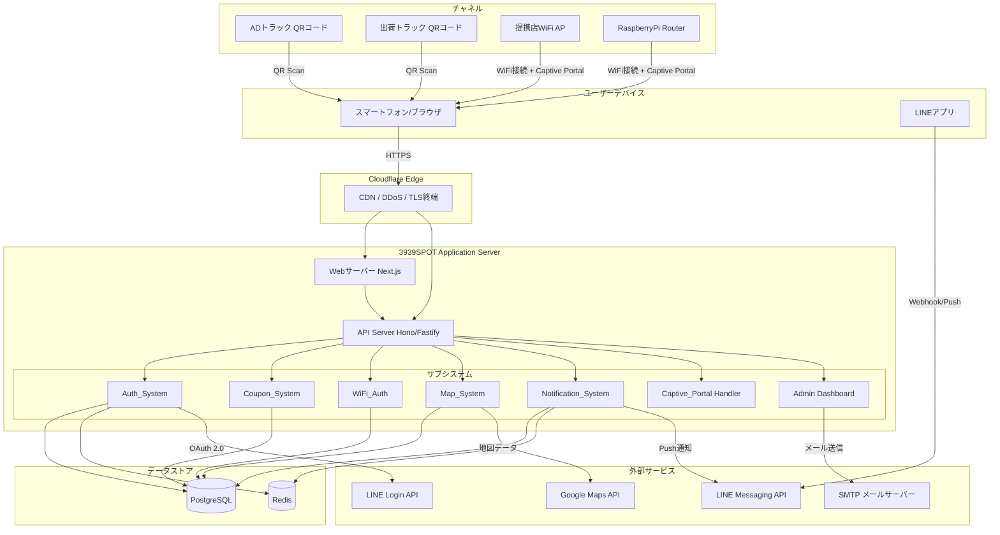
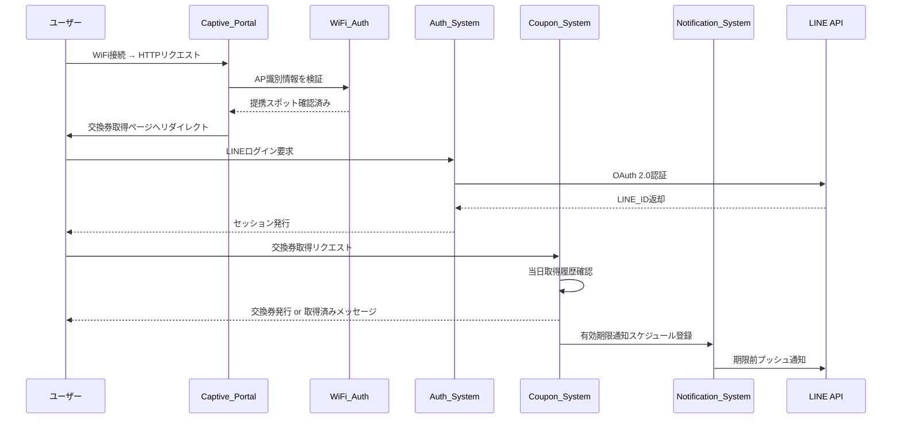
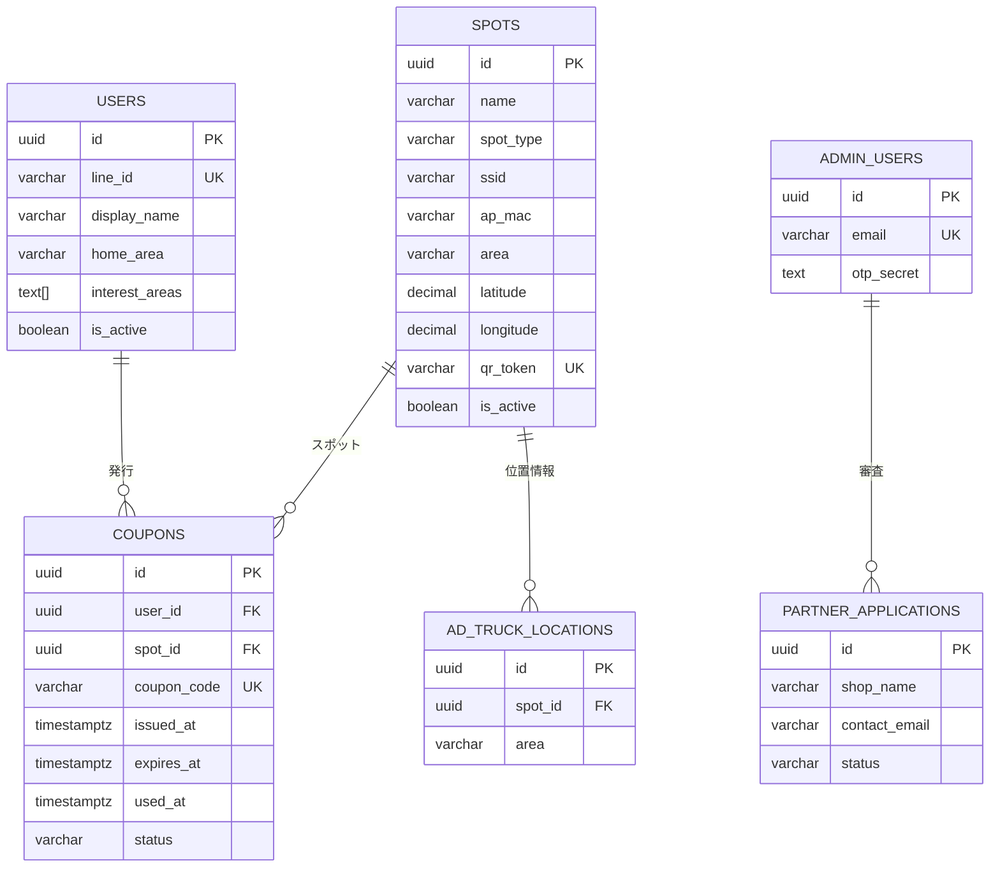
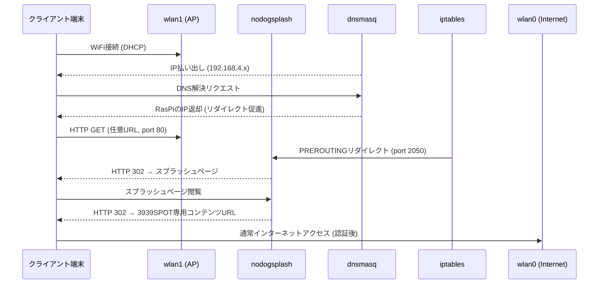

# Design Document: 3939SPOT

## Overview

3939SPOTは、無料WiFiスポットを活用してブラックサンダー（チョコレート菓子）の交換券を配布し、販促活動を促進するWebサービスです。URL: https://3939.spot/

### サービスコンセプト

```
ユーザー体験フロー:
  [ADトラック/出荷トラック発見] → QRコード読み取り → LINE認証 → 交換券取得
  [提携店来店] → WiFi接続 → キャプティブポータル → LINE認証 → 交換券取得
  [LINEbot] → 通知受信 → 提携店マップ → 来店 → 交換券取得
```

### 主要チャネル

1. **ADトラックチャネル**: 日本各地を巡回する広告トラックにQRコードを掲示。ユーザーがスキャンして交換券取得。
2. **出荷トラックチャネル**: 走行中の出荷トラックにQRコードを掲示。通りすがりのユーザーが参加。
3. **提携店WiFiチェックインチャネル**: 提携店のWiFi接続をトリガーにキャプティブポータル経由で交換券取得。
4. **RaspberryPiルーターチャネル**: 専用WiFiルーターを設置、接続ユーザーを専用コンテンツページへ自動誘導。

### 技術スタック選定

| レイヤー | 選定技術 | 理由 |
|---|---|---|
| フロントエンド | Next.js (React) + TypeScript | SSR/SSG対応、SEO、モバイル最適化 |
| バックエンド | Node.js (Hono or Fastify) + TypeScript | 高スループット、軽量、エッジ対応 |
| データベース | PostgreSQL (主DB) + Redis (セッション/レート制限) | トランザクション整合性、高速キャッシュ |
| 認証 | LINE Login API (OAuth 2.0) | ユーザーが既存LINEアカウントを使用 |
| 通知 | LINE Messaging API | LINE経由でのプッシュ通知 |
| 地図 | Google Maps JavaScript API | 提携店マップ表示・検索 |
| インフラ | Cloudflare (CDN/DDoS保護) + VPS | 可用性・セキュリティ |
| RasPi OS | Raspberry Pi OS Lite | hostapd/dnsmasq/nodogsplash動作環境 |

---

## Architecture

### システム全体構成図



### サブシステム間通信



---

## Components and Interfaces

### 1. Auth_System

LINE Login APIを使用したOAuth 2.0認証フローとセッション管理を担当します。

#### エンドポイント

```
GET  /auth/line/login       → LINE OAuthページへリダイレクト
GET  /auth/line/callback    → OAuth callbackハンドラー（コード交換・セッション発行）
POST /auth/logout           → セッション破棄
GET  /auth/me               → 現在のユーザー情報返却
```

#### LINE Webhook エンドポイント

```
POST /webhook/line          → LINE Messaging API Webhook（follow/unfollow/message）
```

#### セッション管理

- セッションはRedisに保存（TTL: 30日、最終アクセスでリセット）
- セッションID はSecure/HttpOnly Cookieで管理
- LINE_IDをユーザー識別子として使用

### 2. Coupon_System

交換券の発行・管理・検証を担当します。

#### エンドポイント

```
POST /api/coupons/issue              → 交換券発行（スポットID必須）
GET  /api/coupons/my                 → 保有交換券一覧取得
GET  /api/coupons/:id                → 交換券詳細取得
POST /api/coupons/:id/verify         → 交換券検証（提携店スタッフ向け）
POST /api/coupons/:id/redeem         → 交換券使用（スタッフ操作）
```

#### 発行ロジック

```
function issueCoupon(userId, spotId, date):
  key = (userId, spotId, date_JST)
  if exists(key): return ALREADY_ISSUED
  coupon = create(userId, spotId, expiresAt: date + 30days)
  set(key) // 重複防止
  return coupon
```

### 3. WiFi_Auth

WiFi接続の正当性を検証します。

#### 検証パターン

- **パターンA（SSID/AP-MAC検証）**: リクエスト元のアクセスポイント識別情報を提携スポットリストと照合
- **パターンB（RasPi検証）**: カスタムHTTPヘッダー `X-RasPi-AP: 1` またはサブネット（192.168.4.0/24）での判定

#### エンドポイント

```
POST /api/wifi/verify        → WiFi接続検証
GET  /api/wifi/spots         → 提携スポット一覧（管理者向け）
```

### 4. Captive_Portal Handler

キャプティブポータル経由でのリダイレクト処理を担当します。

```
GET  /portal                → キャプティブポータルランディング
GET  /portal/redirect       → 認証後コンテンツページへリダイレクト
```

### 5. Map_System

提携店の地図表示・検索を担当します。

#### エンドポイント

```
GET  /api/spots              → 提携スポット一覧（lat/lng/keyword絞り込み対応）
GET  /api/spots/:id          → 提携スポット詳細
POST /api/spots              → 提携スポット登録（管理者）
PUT  /api/spots/:id          → 提携スポット更新（管理者）
DELETE /api/spots/:id        → 提携スポット削除（管理者）
```

#### リアルタイム反映

- 登録・削除操作から5分以内に地図キャッシュを更新
- Redisキャッシュ（TTL: 5分）でパフォーマンスを確保

### 6. Notification_System

LINE Messaging APIを使ったプッシュ通知を担当します。

#### エンドポイント

```
POST /api/admin/notifications/truck   → ADトラック位置更新 + 通知配信
POST /api/admin/notifications/blast   → 一斉メッセージ配信（管理者）
POST /api/admin/notifications/new-spot → 新規提携店通知
```

#### 通知スロットリング

- ADトラック通知: 1ユーザー/1日 最大3回（Redis カウンター使用）
- 有効期限通知: 有効期限3日前にバッチで送信

### 7. Admin Dashboard

管理者専用の一元管理インターフェースを提供します。

#### エンドポイント

```
GET  /admin                          → ダッシュボード（統計）
POST /admin/auth/login               → 管理者ログイン（MFA）
POST /admin/auth/mfa/verify          → OTP検証
GET  /admin/trucks                   → ADトラック一覧
PUT  /admin/trucks/:id/location      → ADトラック位置更新
POST /admin/qr/generate              → QRコード生成
GET  /admin/partners/applications    → 提携申し込み一覧
PUT  /admin/partners/:id/approve     → 提携店承認
DELETE /admin/partners/:id           → 提携店削除
```

### 8. LP・フロントエンドページ

| ページ | パス | 説明 |
|---|---|---|
| LP | `/` | サービス総合案内 |
| 交換券取得 | `/coupon/get?spot=:spotId` | QR/WiFi経由で交換券取得 |
| 交換券一覧 | `/coupon/list` | 保有・履歴一覧 |
| 提携店マップ | `/map` | Google Maps統合検索 |
| 提携店募集 | `/partner` | 提携申し込みページ |
| WiFi限定コンテンツ | `/exclusive` | WiFi接続限定コンテンツ |
| 管理者 | `/admin` | 管理者ダッシュボード |

---

## Data Models

### users テーブル

```sql
CREATE TABLE users (
    id            UUID PRIMARY KEY DEFAULT gen_random_uuid(),
    line_id       VARCHAR(100) UNIQUE NOT NULL,
    display_name  VARCHAR(255),
    picture_url   TEXT,
    home_area     VARCHAR(100),            -- 居住地（街単位）
    interest_areas TEXT[],                 -- 関心地域リスト
    is_active     BOOLEAN DEFAULT TRUE,    -- LINEbot ブロック状態
    created_at    TIMESTAMPTZ DEFAULT NOW(),
    updated_at    TIMESTAMPTZ DEFAULT NOW()
);
```

### spots テーブル（WiFiスポット）

```sql
CREATE TABLE spots (
    id            UUID PRIMARY KEY DEFAULT gen_random_uuid(),
    name          VARCHAR(255) NOT NULL,   -- スポット名
    spot_type     VARCHAR(20) NOT NULL,    -- 'ad_truck' | 'ship_truck' | 'store' | 'raspi'
    ssid          VARCHAR(100),            -- 提携店WiFi SSID
    ap_mac        VARCHAR(17),             -- アクセスポイントMAC
    address       TEXT,                   -- 住所
    area          VARCHAR(100),            -- 街単位エリア
    latitude      DECIMAL(9,6),
    longitude     DECIMAL(9,6),
    business_hours TEXT,                  -- 営業時間
    wifi_info     TEXT,                   -- WiFi情報
    is_active     BOOLEAN DEFAULT TRUE,
    qr_token      VARCHAR(100) UNIQUE,    -- QRコードに埋め込むトークン
    created_at    TIMESTAMPTZ DEFAULT NOW(),
    updated_at    TIMESTAMPTZ DEFAULT NOW()
);
```

### coupons テーブル

```sql
CREATE TABLE coupons (
    id              UUID PRIMARY KEY DEFAULT gen_random_uuid(),
    user_id         UUID NOT NULL REFERENCES users(id),
    spot_id         UUID NOT NULL REFERENCES spots(id),
    coupon_code     VARCHAR(64) UNIQUE NOT NULL,   -- ワンタイムトークン
    issued_at       TIMESTAMPTZ DEFAULT NOW(),
    expires_at      TIMESTAMPTZ NOT NULL,          -- 取得日 + 30日
    used_at         TIMESTAMPTZ,                   -- 使用日時
    used_spot_id    UUID REFERENCES spots(id),     -- 使用店舗
    status          VARCHAR(20) DEFAULT 'active',  -- 'active' | 'used' | 'expired'
    expiry_notified BOOLEAN DEFAULT FALSE,         -- 期限前通知送信済み
    CONSTRAINT unique_daily_spot 
        UNIQUE (user_id, spot_id, (issued_at::DATE AT TIME ZONE 'Asia/Tokyo'))
);
```

### sessions テーブル（Redis 補完用、PostgreSQLにも保持）

```sql
CREATE TABLE sessions (
    id          VARCHAR(128) PRIMARY KEY,
    user_id     UUID NOT NULL REFERENCES users(id),
    created_at  TIMESTAMPTZ DEFAULT NOW(),
    expires_at  TIMESTAMPTZ NOT NULL,
    last_seen   TIMESTAMPTZ DEFAULT NOW()
);
```

### partner_applications テーブル（提携申し込み）

```sql
CREATE TABLE partner_applications (
    id              UUID PRIMARY KEY DEFAULT gen_random_uuid(),
    shop_name       VARCHAR(255) NOT NULL,
    address         TEXT NOT NULL,
    contact_name    VARCHAR(255) NOT NULL,
    contact_email   VARCHAR(255) NOT NULL,
    wifi_info       TEXT NOT NULL,
    status          VARCHAR(20) DEFAULT 'pending', -- 'pending' | 'approved' | 'rejected'
    submitted_at    TIMESTAMPTZ DEFAULT NOW(),
    reviewed_at     TIMESTAMPTZ,
    reviewer_id     UUID REFERENCES admin_users(id)
);
```

### admin_users テーブル

```sql
CREATE TABLE admin_users (
    id              UUID PRIMARY KEY DEFAULT gen_random_uuid(),
    email           VARCHAR(255) UNIQUE NOT NULL,
    password_hash   TEXT NOT NULL,
    otp_secret      TEXT NOT NULL,   -- TOTP秘密鍵
    created_at      TIMESTAMPTZ DEFAULT NOW()
);
```

### ad_truck_locations テーブル

```sql
CREATE TABLE ad_truck_locations (
    id          UUID PRIMARY KEY DEFAULT gen_random_uuid(),
    spot_id     UUID NOT NULL REFERENCES spots(id),
    area        VARCHAR(100) NOT NULL,
    updated_at  TIMESTAMPTZ DEFAULT NOW(),
    updated_by  UUID REFERENCES admin_users(id)
);
```

### Redisキー設計

```
session:{sessionId}                        → ユーザーセッション（TTL: 30日）
coupon:daily:{userId}:{spotId}:{dateJST}   → 1日1枚制限フラグ（TTL: 翌日00:00まで）
rate_limit:ip:{ipAddress}                  → IPレート制限カウンター（TTL: 5分）
notif:truck:{userId}:{dateJST}             → ADトラック通知カウンター（TTL: 翌日00:00まで）
spots:cache                                → 提携スポット一覧キャッシュ（TTL: 5分）
```

### データモデル ER図



---

## RaspberryPi Router 設計

### ハードウェア構成

```
Raspberry Pi Zero W
  wlan0 (内蔵WiFi) ──→ 上流WiFi (インターネット接続, clientモード)
  wlan1 (USB WiFiアダプタ) ──→ ユーザー向けSSID (APモード)
```

### ソフトウェアスタック

```
OS: Raspberry Pi OS Lite
├── hostapd      (wlan1 アクセスポイント)
├── dnsmasq      (DHCP: 192.168.4.2-100 / DNS redirect)
├── nodogsplash  (Captive Portal, splash-onlyモード)
├── iptables     (NAT MASQUERADE, HTTP→ポートリダイレクト)
└── wpa_supplicant (wlan0 上流WiFi接続管理)
```

### ネットワークフロー



### 識別ヘッダー付与

nodogsplashのカスタム設定でHTTPリクエストに以下のヘッダーを付与し、WiFi_Authがバックエンドで検証します:

```
X-RasPi-AP: 1
X-RasPi-Spot-ID: {raspi_spot_uuid}
```

---

## Error Handling

### エラー分類とハンドリング方針

| エラー種別 | 対応方針 | ユーザー表示 |
|---|---|---|
| LINE認証失敗 | ログイン画面へリダイレクト | 「LINEログインが必要です」 |
| 交換券取得済み | 200 OK + メッセージ表示 | 「本日は既に取得済みです」 |
| WiFi検証失敗 | 403 Forbidden | 「対象WiFiへの接続が必要です」 |
| レート制限 | 429 Too Many Requests | 「しばらくお待ちください」 |
| 有効期限切れ交換券 | 200 OK + 無効表示 | 「無効な交換券です」 |
| 管理者認証失敗 | 401 Unauthorized | 「認証に失敗しました」 |
| 外部API障害 (LINE/Maps) | サーキットブレーカー + フォールバック | 「一時的なエラーです。再試行してください」 |
| DBエラー | 503 Service Unavailable | 「サービスが一時的に利用できません」 |

### セキュリティエラー処理

- 不正リクエスト検知時はエラー詳細を隠蔽（攻撃情報を与えない）
- すべてのエラーをログ収集基盤へ記録（PII除去済み）
- レート制限到達時は管理者へSlack/メールアラート送信

### RaspberryPi障害対応

- 上流WiFi切断時: wpa_supplicantが自動再接続を試みる
- サービス障害時: systemdが各デーモンを自動再起動
- OS再起動後: 60秒以内に全サービス自動復旧

---

## Testing Strategy

本システムはWebアプリケーション・外部API連携・ハードウェアデバイスを含む複合システムです。テスト戦略は以下の複数レイヤーで構成します。

### テストレイヤー

#### 1. Unit Tests（単体テスト）

純粋関数・ビジネスロジックのテスト:

- **Coupon_System**: 発行ロジック・有効期限計算・重複防止ロジック
- **WiFi_Auth**: AP識別ロジック・ヘッダー検証・サブネット判定
- **Notification_System**: 通知スロットリングロジック・エリアマッチング
- **Auth_System**: セッション有効期限計算・LINE_IDバリデーション

#### 2. Property-Based Tests（性質ベーステスト）

universalな性質を検証するために[fast-check](https://github.com/dubzzz/fast-check)（TypeScript/JavaScript向けPBTライブラリ）を使用します。各プロパティテストは最低100イテレーション実行します。

タグ形式: `Feature: 3939spot, Property {番号}: {性質テキスト}`

#### 3. Integration Tests（統合テスト）

外部サービス連携・インフラの検証:

- LINE Login APIとの認証フロー（テスト用LINE Channel使用）
- Google Maps APIとのスポット表示連携
- PostgreSQL/Redisとのデータ永続化
- LINE Messaging APIとの通知送信（テスト用送信先）

#### 4. E2E Tests（シナリオテスト）

Playwright使用:

- QRコードスキャン → LINE認証 → 交換券取得フロー
- 提携店WiFi接続 → キャプティブポータル → 交換券取得フロー
- LINEbot メニュー操作フロー
- 管理者ダッシュボード操作フロー

#### 5. Smoke Tests（スモークテスト）

本番デプロイ後の基本動作確認:

- サービス起動確認
- HTTPSリダイレクト確認
- LINE認証エンドポイント疎通確認
- RasPiルーター自動起動確認

### テスト環境

```
開発環境:   ローカル + Docker Compose (PostgreSQL/Redis)
ステージング: 本番同等インフラ + テスト用LINE Channel
本番:       Smoke Testsのみ実行
```

---

## Correctness Properties

*A property is a characteristic or behavior that should hold true across all valid executions of a system — essentially, a formal statement about what the system should do. Properties serve as the bridge between human-readable specifications and machine-verifiable correctness guarantees.*

プレワーク分析に基づき、以下の性質を特定しました。プロパティの冗長性検討（Property Reflection）の結果:

- **統合**: Property 3（ワンタイム性）と旧Property 7（一意性）は「交換券の不変不正使用防止」として統合。
- **除外**: 提携店マップの5分以内リアルタイム反映は、キャッシュTTL設定値に依存するINTEGRATIONテストが適切なため除外。
- **残存プロパティ**: 7つの独立した普遍的性質。

### Property 1: 交換券の1日1スポット制限

*For any* ユーザーIDとスポットIDの組み合わせについて、同じ日（日本標準時 00:00〜23:59）に対して交換券発行を複数回試みた場合、2回目以降の発行は必ず拒否され、システムに保存される当該ユーザー・スポット・日付の交換券数は常に1枚以下である。

**Validates: Requirements 2.4, 2.5, 3.3, 3.4, 4.5, 4.6, 14.1**

### Property 2: 交換券の有効期限は取得日から正確に30日

*For any* 正常に発行された交換券について、`expires_at` フィールドの値は `issued_at` のJST日付に対して30日後となっており、この数値的関係はすべての交換券（ADトラック・出荷トラック・提携店の区別なく）に成立する。

**Validates: Requirements 2.6, 3.5, 4.7, 11.1**

### Property 3: 交換券コードのワンタイム性と全体一意性

*For any* 発行されたすべての交換券について、(a) 各 `coupon_code` はシステム全体で一意であり、(b) 使用済み（status = 'used'）になった後に同一コードで再度検証リクエストした場合、システムは必ず無効レスポンスを返す。

**Validates: Requirements 11.1, 11.3, 11.4, 11.5, 14.5**

### Property 4: WiFi検証なしでは交換券は取得できない

*For any* 交換券取得リクエストについて、WiFi_Authによる提携スポット検証を通過していない場合（提携スポット外ネットワーク・不正ヘッダー・対象外サブネット）、Coupon_Systemは交換券を発行せずリクエストを拒否する。

**Validates: Requirements 4.1, 5.2, 5.7, 14.3**

### Property 5: ADトラック通知の1日上限遵守

*For any* ユーザーについて、1日（JST 00:00〜23:59）の間にそのユーザーへ送信されたADトラック関連の通知数は、通知送信回数がいかに多くなっても必ず3回以下に制限される。

**Validates: Requirements 8.5**

### Property 6: IPレート制限の普遍的適用

*For any* IPアドレスについて、5分間のウィンドウ内に10回以上の交換券取得リクエストが到達した場合、11回目以降のリクエストは必ずブロックされる（同一IPからの大量リクエストに対して一貫して適用される）。

**Validates: Requirements 14.4**

### Property 7: セッションの有効期限管理

*For any* セッションについて、セッション最終アクセス日時から30日を超えて経過した後に当該セッションIDでAPIへアクセスした場合、システムは必ず認証エラーを返し、アクセスを拒否する。

**Validates: Requirements 6.4**
